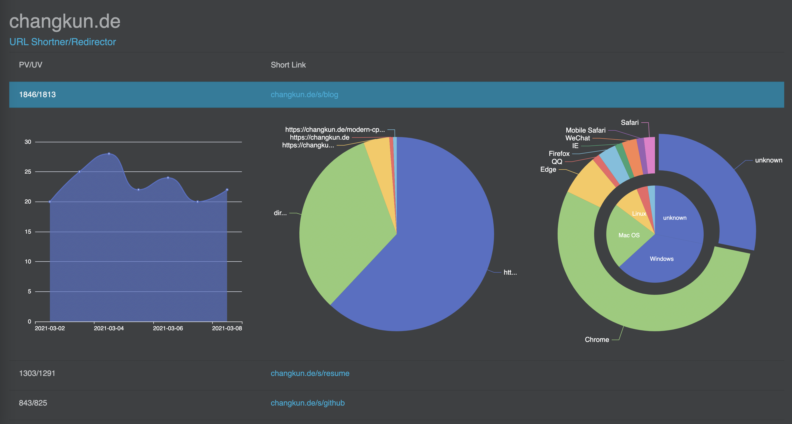

# redir [](https://pkg.go.dev/changkun.de/x/redir) 

Self-hosted link shortener and request redirector.

## Features

- Link shortner: support `/s` for short semantic alias and `/r` for anonymous shortening
- Go's [Vanity Import](https://golang.org/cmd/go/#hdr-Remote_import_paths): redirect `domain/x` to configured VCS and `pkg.go.dev` for API documentation
- PV/UV timeline visualization
- Visitor referer visualization
- Visitor device visualization
- ...More



Index page at: [changkun.de/s](https://changkun.de/s).

## CLI Usage

```
$ redir

usage: redir [-s] [-f <file>] [-op <operator> -a <alias> -l <link> -p -vt <time>]
options:
  -a string
        Alias for a new link
  -f string
        Import aliases from a YAML file
  -l string
        Actual link for the alias, optional for delete/fetch
  -op string
        Operators, create/update/delete/fetch (default "create")
  -p    The link is private and will not be listed in the index page, avaliable for operator create/update
  -s    Run redir server
  -vt string
        the alias will start working from the specified time, format in RFC3339, e.g. 2006-01-02T15:04:05Z07:00. Avaliable for operator create/update (default "2006-01-02T15:04:05Z07:00")

examples:
redir -s
	Run the redir server

redir -f ./import.yml
	Import aliases from a file

redir -a changkun -l https://changkun.de
	Allocate new short link if possible

redir -l https://changkun.de
	Allocate a random alias for the given link if possible

redir -op fetch -a changkun
	Fetch alias information

redir -op update -a changkun -l https://blog.changkun.de -p
	The alias will not be listed in the index page
	$ redir -op update -a changkun -l https://blog.changkun.de -p

redir -op update -a changkun -l https://blog.changkun.de -vt 2022-01-01T00:00:00+08:00
	The alias will be accessible starts from 2022-01-01T00:00:00+08:00.

redir -op delete -a changkun
	Delete the alias from database
```

```
$ redir -a changkun -l https://changkun.de
$ redir -l https://changkun.de
$ redir -f import.yml
$ redir -op fetch -a changkun
$ redir -op update -a changkun -l https://blog.changkun.de
$ redir -op delete -a changkun
```

## Deployment

Build native binary:

```sh
$ make
$ redir -s # run the server
```

Build and deploy with Docker:

```
$ docker network create traefik_proxy
$ make build && make up
```

## Configuration

The [default configuration](./config.yml) is embedded into the binary.

Alternative configuration can be used to replace default config and specified in environtment variable `REDIR_CONF`, for example `REDIR_CONF=/path/to/config.yml redir -s` to run the redir server under given configuration.

## Troubleshooting regarding Private Vanity URL Imports


```
$ git config --global url."git@github.com:".insteadOf "https://github.com/"
$ echo "export GOPRIVATE=changkun.de/x" >> ~/.zshrc
```

## Who is using this service?

Existing famous link shortener service, such as `bitly`, `tinyurl`, etc.,
offers similar features but requires an unreasonably overpriced subscription fee.
Therefore, the initial purpose of building this service is to support link
shortener under domain [changkun.de](https://changkun.de), and
it is the currently active user of this service.

Project `redir` was initially written under [golang.design/s/redir](https://golang.design/s/redir),
due to the different requirements, but this project has branched out from it
and now has a different architecture and feature set.

To know more users, check our [wiki](https://github.com/changkun/redir/wiki) page.

## License

MIT &copy; 2020-2021 [Changkun Ou](https://changkun.de)