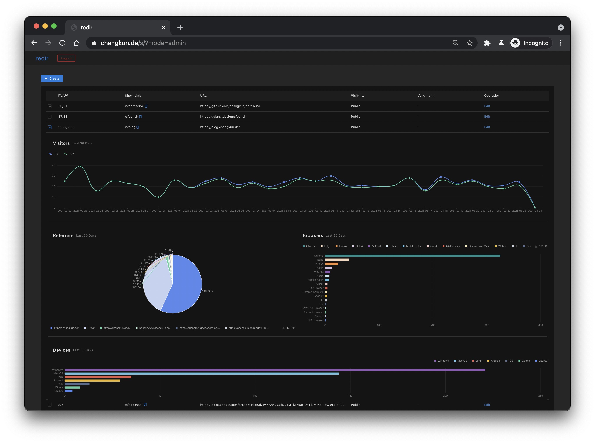
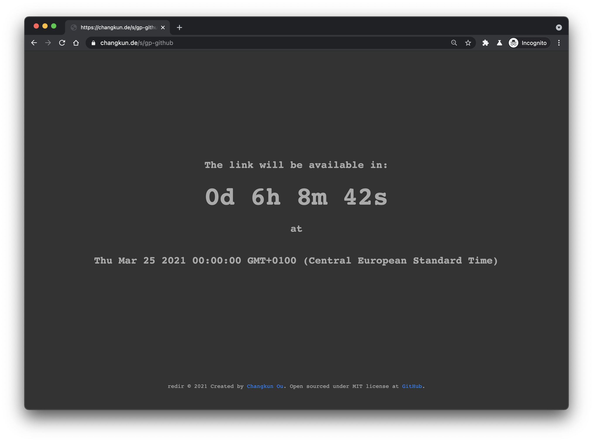
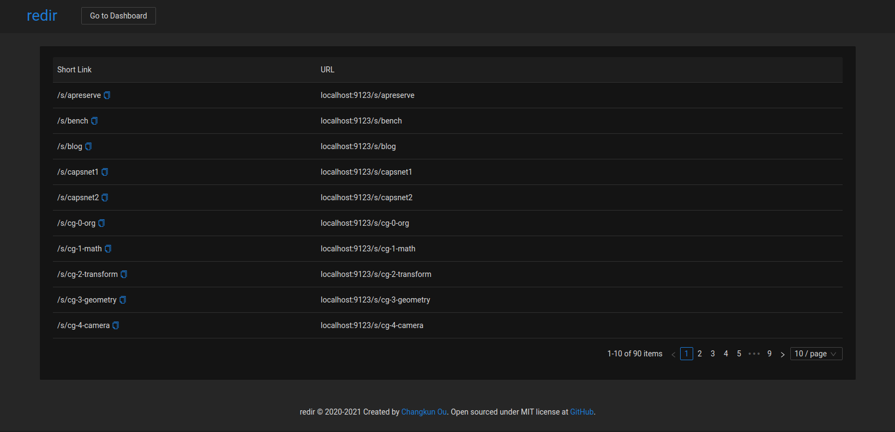

# redir [](https://github.com/changkun/redir/releases) 

Full-featured, self-hosted URL shortener written in Go.

| Features | Description |
|:-------:|:------------|
|**Custom Domain**| Everything is under control with your own domain |
|**Link Shortener**| Support `/s/semantic-name` for short semantic alias and `/r/random-str` for anonymous shortening |
|**Go [Vanity Import](https://golang.org/cmd/go/#hdr-Remote_import_paths)**|Redirect `/x/repo-name` to configured VCS and `pkg.go.dev` for API documentation|
|**Access Control**| 1) Private links won't be listed in public index page; 2) Allow link to be accessible only after a configured time point; 3) Allow warn to visitors about external URL redirects (for liability control)|
|**Public Indexes**| Router `/s` provides a list of avaliable short links |
|**Admin Dashboard**| Dashboard `/s?mode=admin` provides full management ability |
|**Visitor Analysis**| Statistics visualization regarding PV, UV, Referrer, Devices, Location, etc |
|**GDPR Compliant**| Including imprint, privacy, contact pages; optional warning about external redirects, etc. |

## Documentations

- [Redir APIs](./docs/api.md)
- [Current Users](./docs/users.md)
- [Troubleshoting](./docs/trouble.md)
- [GDPR requirements](./docs/gdpr.md)

## Web Interfaces

There are three major pages available in redir.

| Admin Dashboard | Access Control | Public Indexes |
|:---------------:|:--------------:|:--------------:|
| Router: `/s?mode=admin` or<br/>`/r?mode=admin` for management:<br/> | Control a link should only be available after a certain time:<br/> | Router `/s` or `/r` provides public accessibility to see all public links:<br/> |

## CLI Usage

The `redir` command offers server side operation feature from shell:

```
$ redir

redir is a featured URL shortener. The redir server (run via '-s' option),
will connect to the default database address mongodb://localhost:27018.
It is possible to reconfig redir using an external configuration file.
See https://changkun.de/s/redir for more details.

Version: dev

GoVersion: devel go1.18-39e08c6cd7 Tue Sep 21 13:18:09 2021 +0000

Command line usage:

$ redir [-s] [-f <file>] [-d <file>] [-op <operator> -a <alias> -l <link> -p -trust -vt <time>]

...
```

## Customization

You can configure redir using a configuration file.
The [default configuration](./internal/config/config.yml) is embedded into the binary.

Alternative configuration can be used to replace default config and specified in environtment variable `REDIR_CONF`, for example `REDIR_CONF=/path/to/config.yml redir -s` to run the redir server under given configuration.

## Deployment

### Download Pre-Builds

Please check the [release](https://github.com/changkun/redir/releases) page.

### Build from Source

You need install [Go](https://golang.org) to build the `redir` command.

Build everything into a single native binary:

```sh
$ make dashboard # build front-end
$ make           # build back-end and embed front-end files into binary

$ redir -s # run the server, require an external database
```

Build and deploy with Docker:

```
$ docker network create traefik_proxy
$ make dashboard && make build && make up
```

## Contributing

Easiest way to contribute is to provide feedback! We would love to hear
what you like and what you think is missing. PRs are also welcome.

## License

MIT &copy; 2020-2021 [Changkun Ou](https://changkun.de)