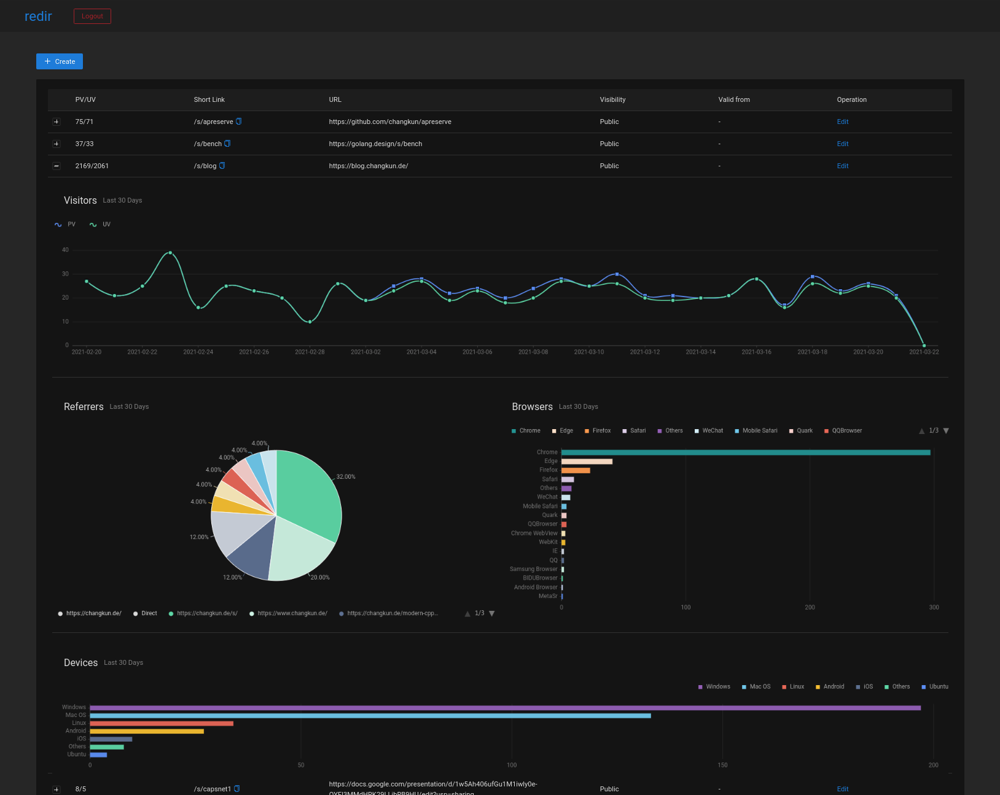

# redir [](https://github.com/changkun/redir/releases) 

Full-featured, self-hosted URL shortener written in Go.

## Features

- **Custom domain**: everything is under control with your own domain
- **Link shortener**: support `/s/semantic-name` for short semantic alias and `/r/random-str` for anonymous shortening
- **Go [Vanity Import](https://golang.org/cmd/go/#hdr-Remote_import_paths)**: redirect `/x/repo-name` to configured VCS and `pkg.go.dev` for API documentation
- **Access control**
  + Private links won't be listed in public index page
  + Allow link to be accessible only after a configured time point
  + Allow link to be expire after a configured time point
  + Allow warn to visitors about external URL redirects (for liability control)
- **Public indexes**: `/s`
- **Admin dashboard**: `/s?mode=admin`
- **Visitor analysis**: Statistics visualization regarding PV, UV, Referrer, Devices, Location, etc
- **GDPR friendly**: Including impressum, privacy, contact pages; optional warning about external redirects, etc.

## Web Interfaces

There are three major pages available in redir.

### Admin Dashboard

Router: `/s?mode=admin` or `/r?mode=admin`



### Accessible Control

Control if a link should only be available after a certain time point:


### Public Indexes

Router: `/s` or `/r`


## CLI Usage

The `redir` command offers server side operation feature from shell:

```
$ redir

redir is a featured URL shortener. The redir server (run via '-s' option),
will connect to the default database address mongodb://localhost:27018.
It is possible to reconfig redir using an external configuration file.
See https://changkun.de/s/redir for more details.

Version: dev

GoVersion: devel go1.18-39e08c6cd7 Tue Sep 21 13:18:09 2021 +0000

Command line usage:

$ redir [-s] [-f <file>] [-d <file>] [-op <operator> -a <alias> -l <link> -p -trust -vt <time>]

options:
  -a string
        Alias for a new link
  -d string
        Dump aliases from database and export as a YAML file
  -f string
        Import aliases from a YAML file
  -l string
        Actual link for the alias, optional for delete/fetch
  -op string
        Operators, create/update/delete/fetch (default "create")
  -p    The link is private and will not be listed in the index page, avaliable for operator create/update
  -s    Run redir server
  -trust
        The link is either trusted to not show privacy warning page or untrusted to show privacy warning page for external redirects
  -vt string
        the alias will start working from the specified time, format in RFC3339, e.g. 2006-01-02T15:04:05+07:00. Avaliable for operator create/update

examples:
redir -s
        Run the redir server

redir -f ./template/import.yml
        Import aliases from a file

redir -d ./template/export.yml
        Dump all aliases from database and export in YAML format.

redir -a changkun -l https://changkun.de
        Allocate new short link if possible

redir -l https://changkun.de
        Allocate a random alias for the given link if possible

redir -op fetch -a changkun
        Fetch alias information

redir -op update -a changkun -l https://blog.changkun.de -p
        The alias will not be listed in the index page

redir -op update -a changkun -l https://blog.changkun.de -p -trust
        The alias will not be listed in the index page and will always do the redirect without showing privacy warning

redir -op update -a changkun -l https://blog.changkun.de -vt 2022-01-01T00:00:00+08:00
        The alias will be accessible starts from 2022-01-01T00:00:00+08:00

redir -op delete -a changkun
        Delete the alias from database
```

## Customization

You can configure redir using a configuration file.
The [default configuration](./internal/config/config.yml) is embedded into the binary.

Alternative configuration can be used to replace default config and specified in environtment variable `REDIR_CONF`, for example `REDIR_CONF=/path/to/config.yml redir -s` to run the redir server under given configuration.

## Deployment

### Download Pre-Builds

Please check the [release](https://github.com/changkun/redir/releases) page.

### Build from Source

You need install [Go](https://golang.org) to build the `redir` command.

Build everything into a single native binary:

```sh
$ make dashboard # build front-end
$ make           # build back-end and embed front-end files into binary

$ redir -s # run the server, require an external database
```

Build and deploy with Docker:

```
$ docker network create traefik_proxy
$ make dashboard && make build && make up
```

## APIs

All possible routers: `/s`, `/r`, and `/x`. The `/s` is the most
complicated router because we are limited to use these prefixes
(for many reasons, e.g. deploy to an existing domain that served a lot
different routers. The prefix is configurable).

Thus, all kinds of data, pages, static files are served under this router.

### GET /s

The GET request query parameters of `/s` and `/r` are listed as follows:

- `mode`, possible options: `stats`, `index`, `index-pro`
  + `admin`, access admin dashboard
  + `index-pro` mode, admin only
    - `ps`, page size
    - `pn`, page number
  + `index` mode
    - `ps`, page size
    - `pn`, page number
  + `stats` mode
    - `a`, alias for stat data
    - `stat`, possible options: `referer`, `ua`, `time`
      - `t0`, start time
      - `t1`, end time

### POST /s

The POST request body of `/s` and `/r` is in the following format:

```json
{
    "op": "create",
    "alias": "awesome-link",
    "data": {
        "alias": "awesome-link",
        "url": "https://github.com/changkun",
        "private": true,
        "valid_from": "2022-01-01T00:00:00+00:00"
    }
}
```

## Who is using this service?

Existing famous link shortener services, such as `bitly`, `tinyurl`, etc.,
offer similar features but requires an unreasonably overpriced subscription fee.
Therefore, the initial purpose of building this service is to support link
shortener under domain [changkun.de](https://changkun.de), and
it is one of the active user of this service currently.

I wrote `redir` under [golang.design/s/redir](https://golang.design/s/redir)
initially. Due to the different requirements, this project has branched out
from it and has a different architecture and feature set now.

To know more users, check our [wiki](https://github.com/changkun/redir/wiki) page.

## Contributing

Easiest way to contribute is to provide feedback! We would love to hear
what you like and what you think is missing. PRs are also welcome.

## License

MIT &copy; 2020-2021 [Changkun Ou](https://changkun.de)