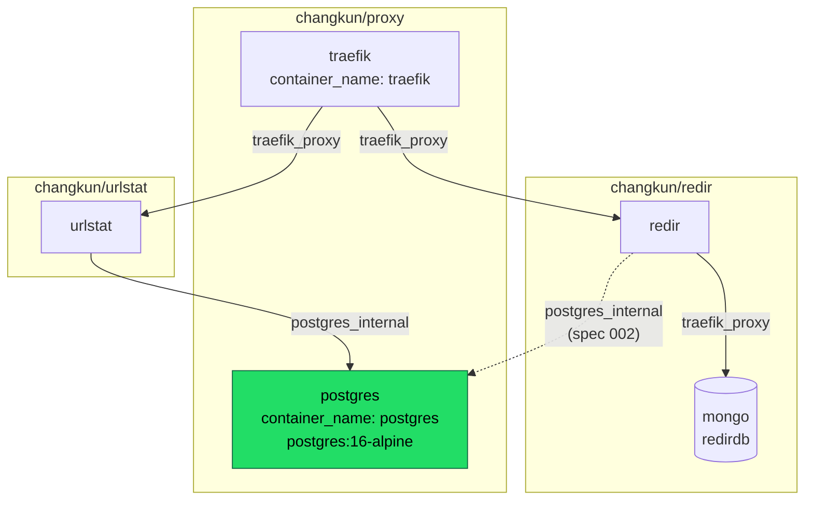

# Shared PostgreSQL instance

## Overview

The PostgreSQL instance on the deploy host is owned by the urlstat compose
project and reachable only from inside it. redir is migrating off MongoDB
and should reuse that instance rather than run a second database container,
so the instance has to become shared infrastructure that both services use
as equal clients.

This spec moves the database out of urlstat and into the repository that
already owns cross-service infrastructure for this host. It changes no
schema and no application logic. It is the prerequisite for
`002-postgres-store.md`.

## Current State

`urlstat/docker-compose.yml` declares the database as a service of the
urlstat project:

```yaml
  urlstatdb:
    image: postgres:16-alpine
    volumes:
      - ./data/postgres:/var/lib/postgresql/data
      - ./migrations:/docker-entrypoint-initdb.d:ro
    healthcheck:
      test: ["CMD-SHELL", "pg_isready -U urlstat"]
    networks:
      - internal
```

On the host this yields:

- container `urlstat-urlstatdb-1`, `postgres:16-alpine`, healthy
- no `container_name`, so the name carries the project prefix
- no published ports
- attached only to `urlstat_internal`, a project-scoped bridge network
- `PGDATA` bind mounted at `/root/changkun.de/urlstat/data/postgres`
- one database `urlstat`, one role `urlstat`, one table `public.visits`

urlstat reaches it at hostname `urlstatdb` through the `URLSTAT_DB`
environment variable, and orders startup with
`depends_on: {urlstatdb: {condition: service_healthy}}`.

redir's services sit on the external `traefik_proxy` network
(`docker/docker-compose.yml`) and therefore cannot resolve or reach
`urlstatdb` at all.

Two properties of the current setup matter for later steps and
are easy to misread:

- The `migrations/` bind mount targets `/docker-entrypoint-initdb.d`, which
  the postgres image runs **only when `PGDATA` is empty**. The volume is
  long since initialised, so adding files there is a silent no-op. Any
  future schema work needs its own path.
- urlstat previously had no database of its own and connected to redir's
  MongoDB at `mongodb://redirdb:27017`, with a `FIXME` in its compose
  conceding the implicit cross-repo dependency. Sharing a datastore between
  these two services is a restoration of a prior arrangement, not a new
  idea; the point of this spec is to make the coupling explicit and owned.

## Architecture

`github.com/changkun/proxy` already owns shared infrastructure for this
host: it holds the traefik reverse proxy and, through it, defines the
`traefik_proxy` network every service joins. The database belongs in the
same place, as a sibling directory following the same compose conventions.



The database keeps its own network rather than joining `traefik_proxy`, so
it stays unreachable from the public ingress path. Services that need it
join `postgres_internal` in addition to `traefik_proxy`, the same way
urlstat is attached to two networks today.

## Components

### proxy/postgres/docker-compose.yml (new)

A new compose project under `changkun/proxy`, following the conventions of
its sibling `proxy/traefik/docker-compose.yml`: an explicit
`container_name`, `restart: always`, a pinned image, and json-file logging
capped at 10m x 3.

- image stays `postgres:16-alpine`, unchanged, so the data directory needs
  no upgrade
- `container_name: postgres`, giving a stable hostname independent of the
  compose project name
- `POSTGRES_USER` / `POSTGRES_PASSWORD` / `POSTGRES_DB` keep their current
  values so urlstat's existing role, database and credentials continue to
  work untouched
- the healthcheck is carried over verbatim
- `PGDATA` bind mounts to `./data/postgres` within this project
- declares network `internal`, which resolves to `postgres_internal`
- adds `mem_limit` and `memswap_limit`, which the current definition lacks
  and redir's MongoDB already sets

The `migrations/` bind mount is **not** carried over. It cannot fire on an
initialised volume, so keeping it would preserve a mechanism that looks
functional and is not.

### urlstat/docker-compose.yml (modify)

- delete the `urlstatdb` service
- declare `postgres_internal` as an external network and attach the
  `urlstat` service to it alongside `traefik_proxy`
- change the `URLSTAT_DB` host from `urlstatdb` to `postgres`

### redir docker/docker-compose.yml (modify)

Attach the `redir` service to `postgres_internal` as well. redir does not
use the database until `002-postgres-store.md`; joining the network now
keeps that spec to a single concern and lets connectivity be proven
independently of any schema work.

## Data Flow

Nothing changes about how a query travels. The only change is name
resolution: urlstat resolves `postgres` on `postgres_internal` instead of
`urlstatdb` on `urlstat_internal`.

## API Surface

| Surface | Before | After |
| --- | --- | --- |
| urlstat env `URLSTAT_DB` | `postgres://urlstat:<pw>@urlstatdb:5432/urlstat?sslmode=disable` | same, host `postgres` |
| container name | `urlstat-urlstatdb-1` | `postgres` |
| network | `urlstat_internal` | `postgres_internal` (external) |
| published ports | none | none |

Credentials, role, database name and schema are unchanged.

## Error Handling

Extracting the database removes a guarantee that must be replaced
consciously: `depends_on: condition: service_healthy` **cannot cross
compose projects**. Once the database is a separate project, urlstat has no
declarative ordering against it.

urlstat's `init()` calls `l.Fatalf` when the connection or ping fails, so
on a cold boot where the database is not yet accepting connections the
container exits and `restart: always` retries. The service converges, but
by crash-looping rather than waiting. That is acceptable for this step and
is called out so it is a known property rather than a surprise; giving
urlstat a bounded connect retry is a reasonable follow-up but is out of
scope here.

The healthcheck moves with the database, so `docker ps` still reports
health, and a human or script can gate on it.

## Cutover

The data directory is the only irreplaceable artifact. The sequence keeps
it recoverable at every point.

1. Record the current row count per hostname from `visits` as the
   comparison baseline.
2. Stop the urlstat project so nothing is writing.
3. Copy, do not move, `urlstat/data/postgres` to `proxy/postgres/data/postgres`.
   Copying leaves the original in place as the rollback.
4. Bring up the new postgres project; wait for the healthcheck.
5. Verify: the `urlstat` database exists, `public.visits` is present, and
   the per-hostname counts match the baseline exactly.
6. Bring up urlstat against the new host and confirm it serves.
7. Only once the service is confirmed healthy, retire the old data
   directory.

Rollback at any step before 7 is: bring the old urlstat compose back up.
The original data directory is untouched and the old definition is one
`git revert` away.

## Testing Strategy

There is no application code in this spec, so verification is operational
and must be evidence-based rather than assumed:

- **Data integrity**: per-hostname `COUNT(*)` from `visits` before and
  after the move must match exactly. A total-only count would hide a
  partial copy.
- **Service health**: urlstat answers over HTTPS after cutover, and its
  container is not in a restart loop (`RestartCount` stays flat).
- **Isolation**: the database is still not reachable from `traefik_proxy`
  and still publishes no host port.
- **redir connectivity**: from the redir container, `postgres:5432` resolves
  and accepts a TCP connection. This proves the network path that spec 002
  depends on, without redir yet holding any schema.
- **Blast radius**: the golang.design redir deployment and every other
  service on `traefik_proxy` are unaffected. Both compose projects on this
  host share the project name `docker`, so `down` and `--remove-orphans`
  stay forbidden.

## Outcome

Landed 2026-08-31. The instance runs as `postgres` under
`changkun/proxy`, on `postgres_internal`, with no published port. All 17
hostnames and 4,516,637 rows in `visits` matched the pre-move baseline
exactly. urlstat reconnected with no restarts, and redir reaches
`postgres:5432`, which is the connectivity `002-postgres-store.md` needs.

One failure worth recording, because it will catch the next service that
joins a second network. redir's deployment config set `addr: redir:80`,
so the server resolved its own hostname and bound to that single address.
With one network that is indistinguishable from binding everything; with
two, it bound the `postgres_internal` address and traefik could no longer
reach it, giving a 502 for about ninety seconds. The fix is `addr: :80`.
The sample config now says so, but the general rule is: **joining a
service to a second network can change which interface it listens on.**
Check the bind address before attaching, not after.

The old data directory at `urlstat/data/postgres` and the stopped
`urlstat-urlstatdb-1` container are both retained as the rollback path and
should be removed once this has run for a few days.
